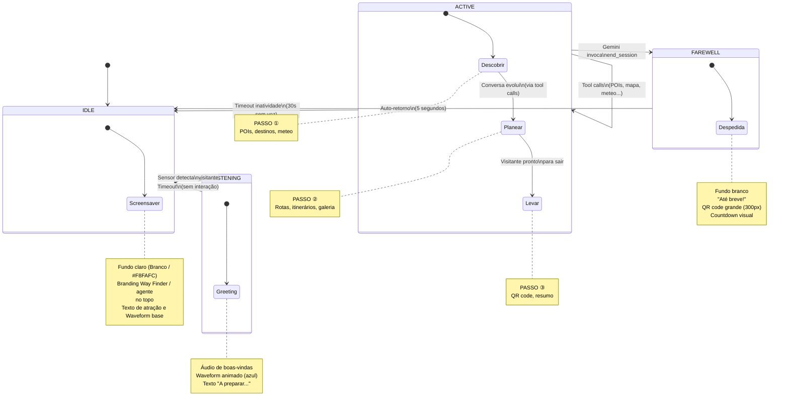
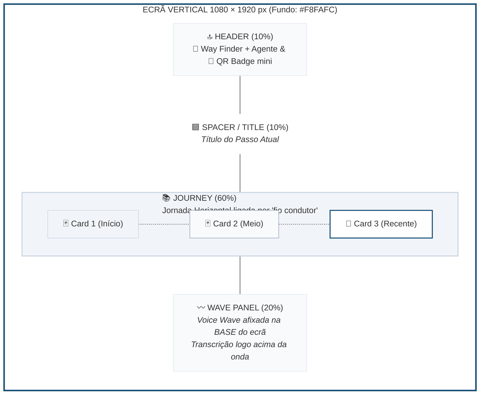
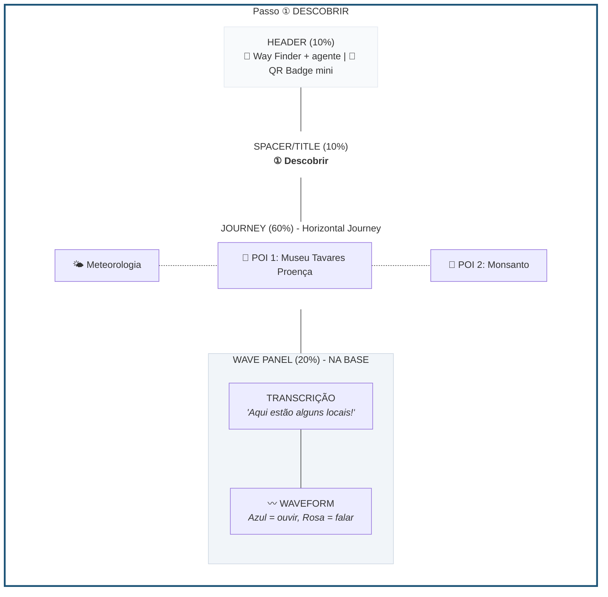
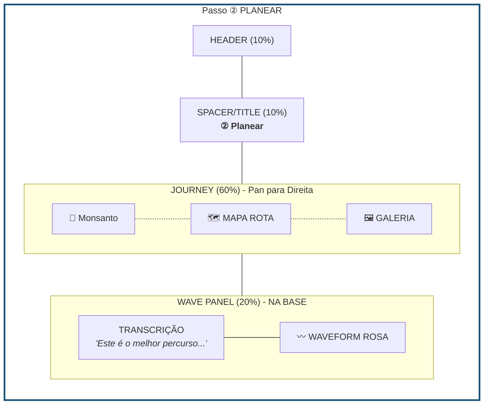
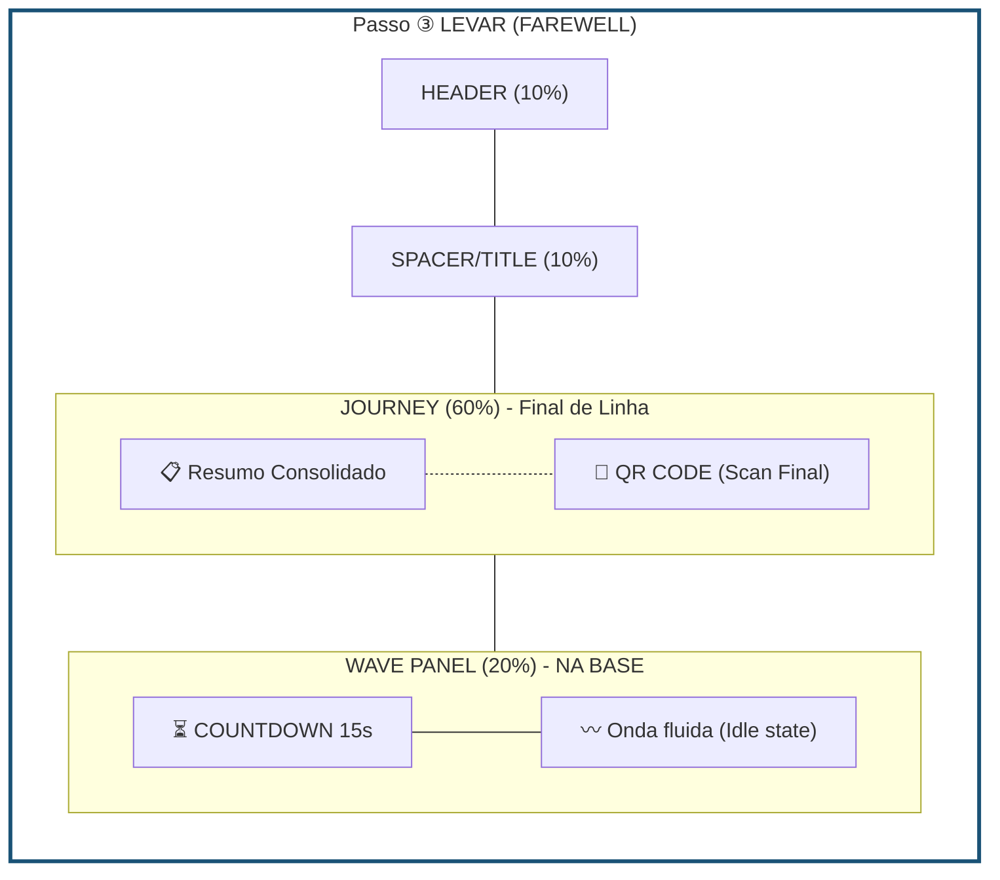
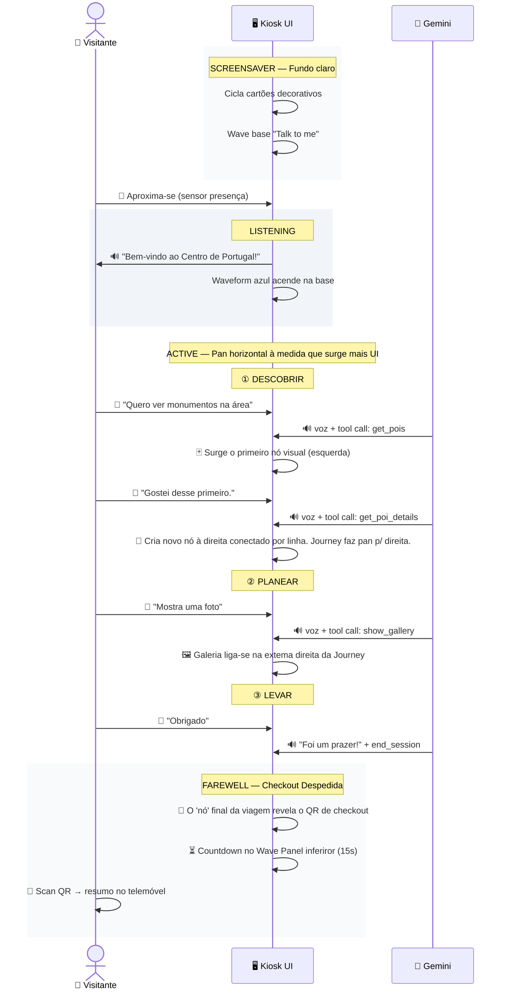
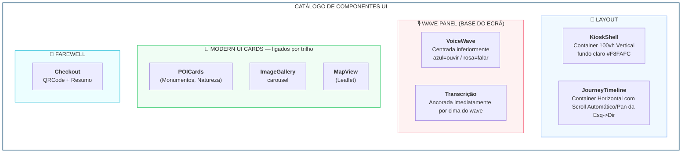
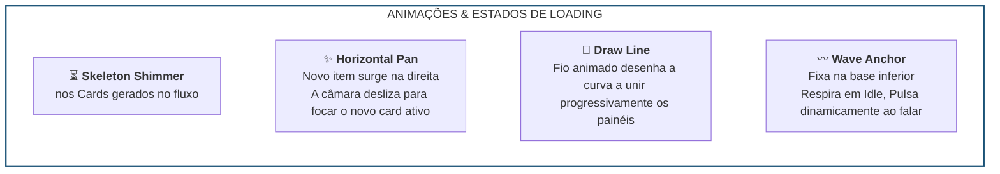

# Kiosk Gen-UI — Brief Visual para UX/UI

> **Projeto**: Way Finder para Turismo Centro de Portugal (CIM)
> **Dispositivo**: Ecrã vertical **1080 × 1920 px** em modo kiosk (Chrome fullscreen)
> **Interação**: 100% por **voz** — sem touch, sem teclado
> **Duração por sessão**: 2–5 minutos
> **Fundo principal**: **Totalmente Claro (Branco / #F8FAFC)** em toda a aplicação

---

## 1. O Conceito — "Generative UI"

O kiosk é um **assistente de turismo por voz**. O visitante fala, e a IA (Gemini) responde com voz **e** gera a interface visual em tempo real.

**A UI não é pré-desenhada ecrã a ecrã** — é a IA que decide o que mostrar e quando, conforme a conversa. Tudo acontece em tempo real, sincronizado com a voz. Mantemos o comportamento original do fluxo conversacional, mas a apresentação é feita através de "Modern UI Cards" interligados numa **linha temporal horizontal (Jornada)**.

### Way Finder como shell reutilizável

**Way Finder** é a marca da shell da experiência. O agente regional ou parceiro pode ser CIM, PROVERE ou outro, mas o header, a linguagem do percurso e o comportamento da Journey mantêm-se consistentes. Em termos de produto, o topo do ecrã pode mostrar **Way Finder** como marca principal e a identidade do agente como contexto secundário.

### Journey como camada de representação

A Journey é uma camada de apresentação pura: recebe conteúdo já estruturado e mostra-o em paralelo com a conversa. Não gere WebSocket, não controla áudio e não mantém o estado de sessão. A sua função é apresentar cada novo elemento como mais um passo do percurso, ligado por um trilho orgânico e legível.

### Como funciona (simplificado)

```text
Visitante fala → IA ouve → IA responde com voz
                         → IA gera conteúdo visual (cards, mapas, fotos)
                         → Frontend renderiza em <600ms
```

---

## 2. Fluxo de Ecrãs — Visão Geral

O kiosk tem **4 estados** principais que definem a experiência:



### Resumo dos estados

| Estado | Fundo | Duração | O que acontece |
|--------|-------|---------|---------------|
| **IDLE** (Screensaver) | Claro (Branco / `#F8FAFC`) | Indefinido | Ecrã atrai visitantes com ambiente visual claro. Onda na base. |
| **LISTENING** (Transição) | Claro | 3–5s | Greeting áudio toca, waveform azul pulsa na base. |
| **ACTIVE** (Conversa) | Claro | 2–5 min | Conversa ativa, UI gerada flui numa **Journey** horizontal, em paralelo com a voz. |
| **FAREWELL** (Despedida) | Claro | 15s | QR code, resumo final no extremo direito da Journey, auto-retorno. |

---

## 3. Ecrã a Ecrã — Layout do Shell + Journey

A interface utiliza um **layout fundamental inteiramente vertical (Column 100vh)** num fundo claro, contudo a disposição da informação central avança num fluxo interligado da **esquerda para a direita**. As gerações visuais (cards) comportam-se como pontos numa viagem ("journey"), muitas vezes unidos por uma linha orgânica, situados na área média/superior do ecrã, libertando a **área inferior exclusivamente para a Waveform de Voz**.

O princípio de implementação é separar a shell do kiosk da representação visual do percurso. A shell gere estados, presença, áudio e contexto; a **Journey** gere apenas cards, trilho, metáfora dos passos, foco e progressão visual. A referência histórica para esta linguagem é o **FlowTimeline** já validado no frontend anterior, agora reestruturado para ser mais robusto e desacoplado.

### 3.1 ESTRUTURA GERAL DO ECRÃ (Layout 100vh)

A proporção das secções no ecrã é rigorosamente distribuída de cima para baixo:



**Zonas do layout (Posicionamento):**

| Zona | Proporção | Descrição |
|------|-----------|-----------|
| **Header** | 10% | Marca Way Finder, identidade do agente e indicativo com QR badge. |
| **Spacer/Title** | 10% | Título / Espaço de respiro vertical para manter consistência sem afogar os cards. |
| **Journey** | 60% | Área principal. O conteúdo é acrescentado lado a lado (esquerda-direita), com os cards unidos por um "fio" curvo ou visualmente sequenciados numa progressão temporal. O foco acompanha o item mais recente. |
| **Wave Panel** | 20% | Fixo na base inferior. A onda de voz pulsa na parte de baixo do ecrã com a transcrição atrelada imediatamente acima ou no próprio rodapé. |

---

### 3.2 Passo ① DESCOBRIR — Exemplo com POIs



---

### 3.3 Passo ② PLANEAR — Rota + Galeria



---

### 3.4 Passo ③ FAREWELL — Despedida + QR Code



---

## 4. Fluxo Completo de uma Sessão — Timeline



---

## 5. Catálogo de Componentes



---

## 6. Detalhe dos Componentes de Conteúdo

*(Estruturas físicas dos cartões focadas numa leitura clara à altura dos olhos, agora encadeados de perfil)*

### Paleta de cores por categoria de POI

| Categoria | Ícone | Cor texto | Cor fundo badge | Cor borda badge |
|-----------|-------|-----------|-----------------|-----------------|
| **Monumento** | 🏛 | `amber-600` | `amber-50` | `amber-200` |
| **Natureza** | 🌿 | `emerald-600` | `emerald-50` | `emerald-200` |
| **Restaurante** | 🍴 | `orange-600` | `orange-50` | `orange-200` |
| **Museu** | 🏛 | `purple-600` | `purple-50` | `purple-200` |
| **Igreja** | ⛪ | `blue-600` | `blue-50` | `blue-200` |
| **Hotel** | 🏨 | `pink-600` | `pink-50` | `pink-200` |

---

## 7. Animações e Estados de Loading



---

## 8. Especificações Tipográficas e de Acessibilidade

| Aspeto | Valor |
|--------|-------|
| **Fonte principal** | Montserrat (sans-serif) |
| **Contraste** | Fundo Claro / Branco (#F8FAFC e #FFFFFF), texto escuro |
| **Cards (Modern UI)** | `rounded-2xl`, sombras elegantes (`shadow-xl`) |
| **Border radius base** | 1rem (16px) a 1.5rem |
| **Transcrição** | Sempre visível **junto à base**, acompanhando o Wave Panel. |
| **Safe margin** | 60px nas laterais, baseada num panning lateral infinito. |

---

## 9. Branding — Agente Way Finder

| Elemento | Valor |
|----------|-------|
| **Logo** | Turismo Centro de Portugal |
| **Cor primária** | `#1a5276` (azul escuro) |
| **Cor do waveform (ouvir)** | `#3B82F6` (blue-500) |
| **Cor do waveform (falar)** | `#F43F5E` (rose-500) |
| **Fundo Absoluto (Shell)** | `#F8FAFC` (Slate 50 / Branco minimalista) |

---

## 10. Notas para o Designer

### Layout Horizontal em Viewport Vertical
- Embora seja um ecrã Mupi marcadamente vertical (1080x1920), a resposta cronológica ("Timeline") de resultados interage deslizando lateralmente (Panning).
- O elemento visual âncora desta jornada na Journey é estético: **linha contínua, curva e orgânica** (estilo "mural / roadmap") que liga os cartões gerados. 
- Durante o fluxo conversacional o Kiosk foca horizontalmente no novo termo mais à direita, empurrando os blocos passados para além do viewport (edge esquerdo do ecrã).

### Boundary de implementação
- A shell do kiosk trata presença, áudio, sessão e mudança de estados.
- A Journey trata layout, cards, trilho, foco e progressão visual.
- O input da Journey deve chegar já normalizado por um adapter; a camada visual não deve receber payloads crus do backend ou do Gemini.

### Wave Panel Afixado à Base
- Para aproximar visualmente do visitante as sensações conversacionais modernas de IA nativa (ex: Novo Siri (iOS) no rebordo, Google Assistant overlay bottom-sheet), a onda e a transcrição habitam o "rodapé" ou a **área de fundo inferior** do Mupi. O ecrã reserva-se visualmente todo do meio para cima para as informações relevantes dos passeios.

### O que o designer pode propor
- **Design da Linha Conetora:** Como a "corda ondulante/trilho" entra, sai de trás de foco, e abraça de forma orgânica cada Cartão.
- **Tratamento das margens visuais:** O corte horizontal progressivo (fade-out / desfoque lateral no espaço 100vh) quando se arrastam os cards antigos para fora do palco visual principal.
- **Integração refinada das Transcrições:** Como a legenda flutua acima com a Wave na Base Inferior num enquadramento natural perante um cenário vazio (idle) ou populado a meio do ecrã (active).